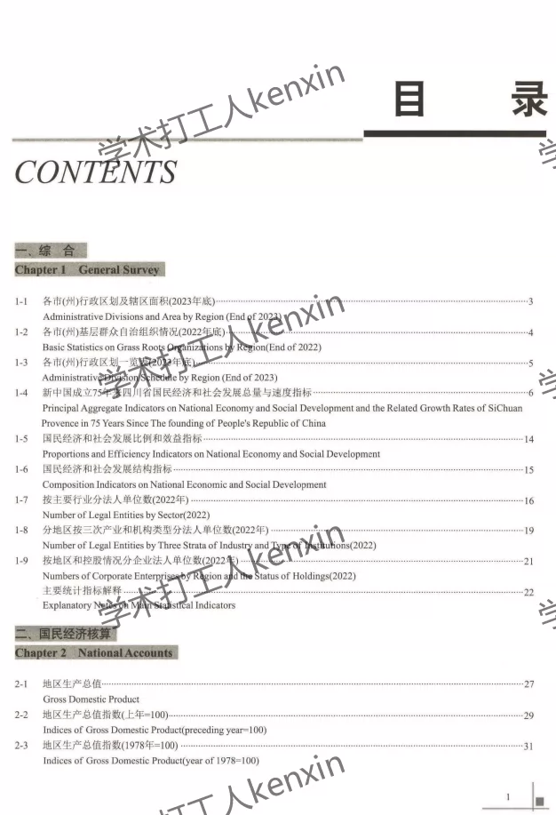
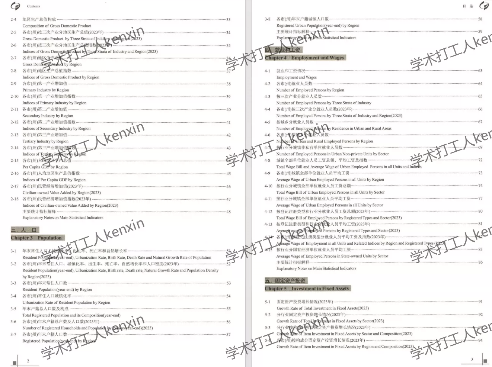
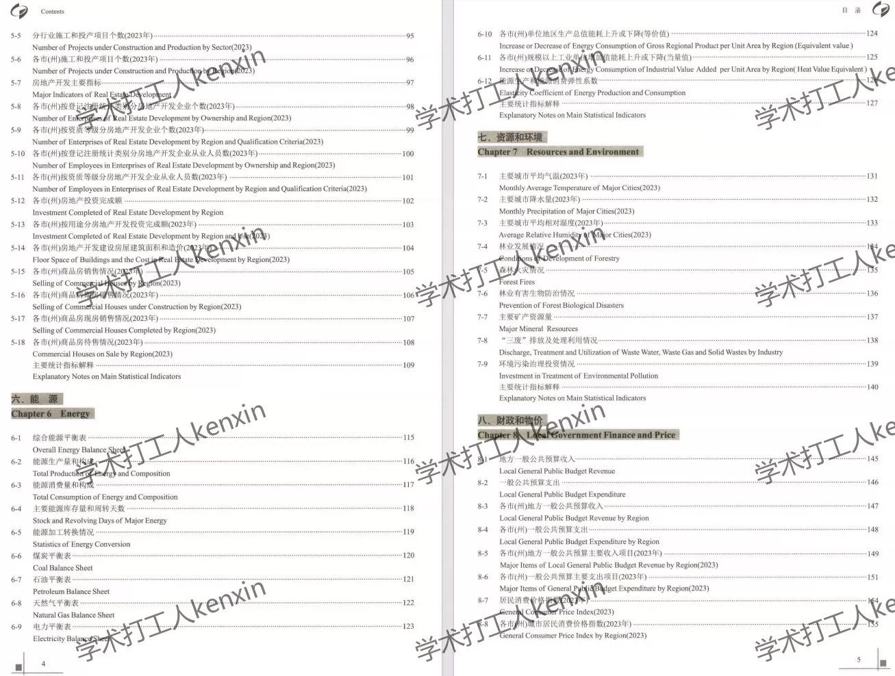
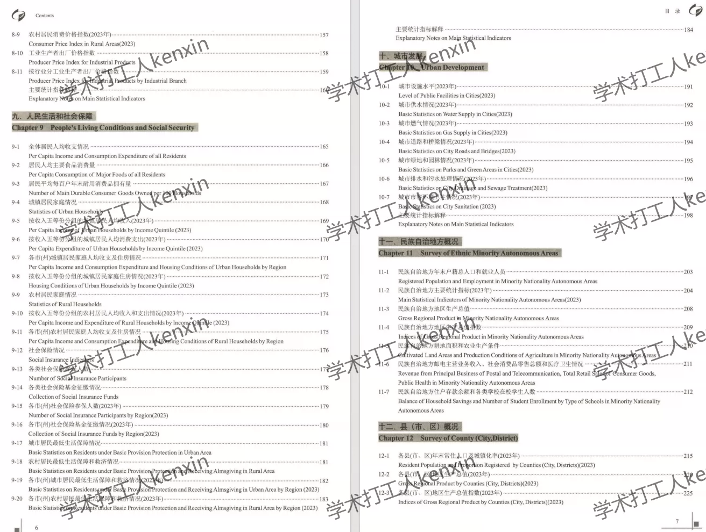
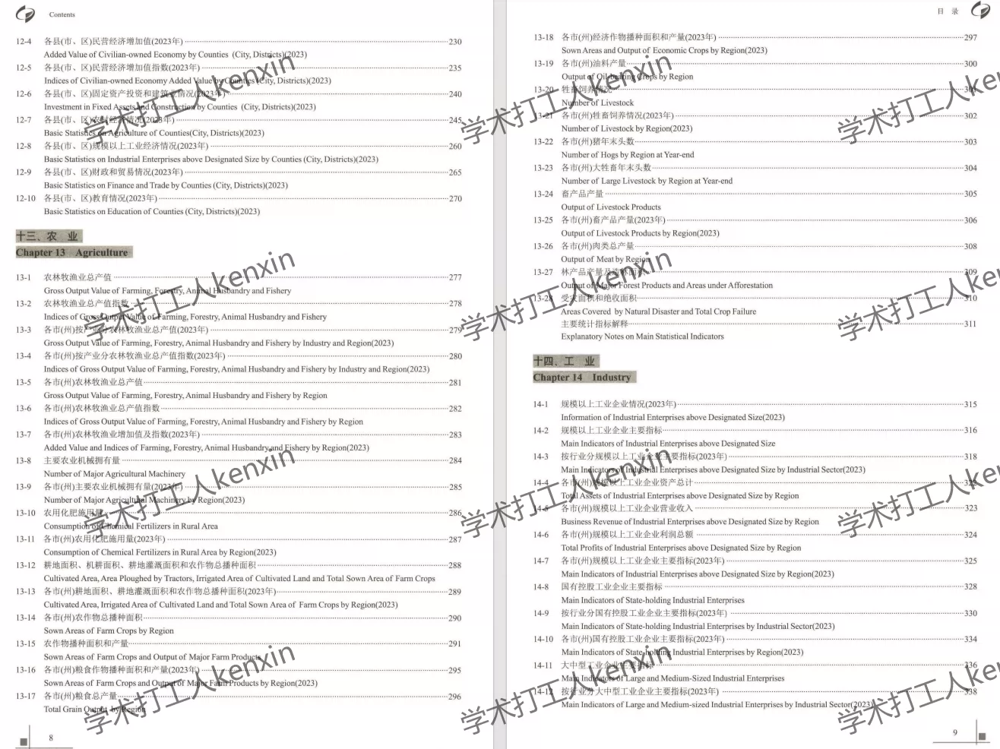
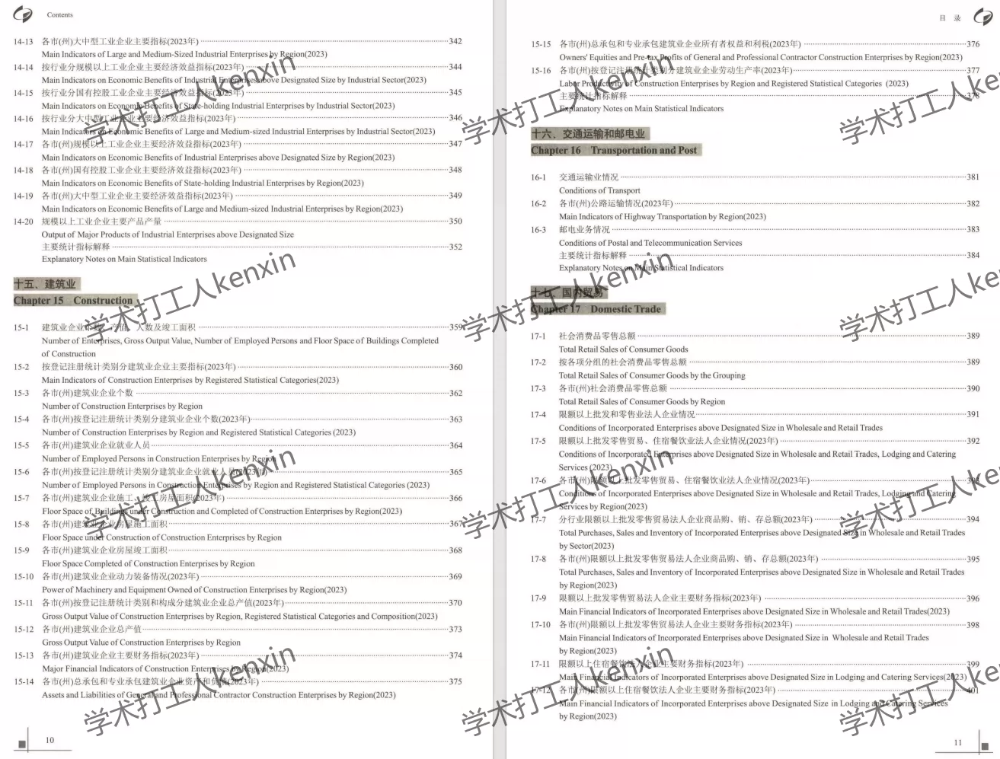
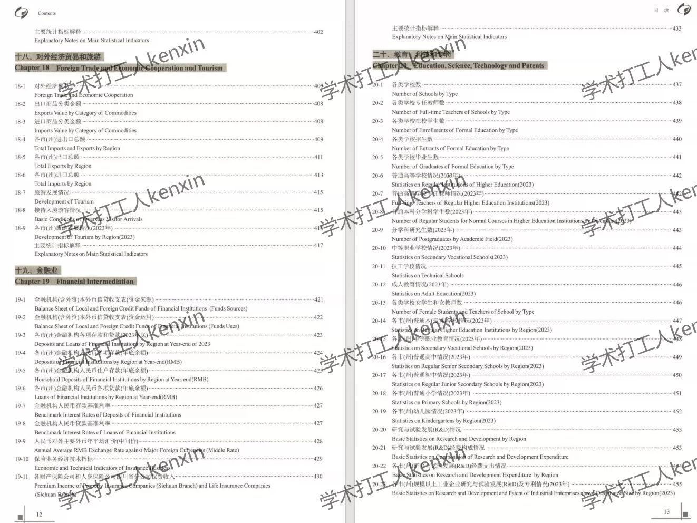
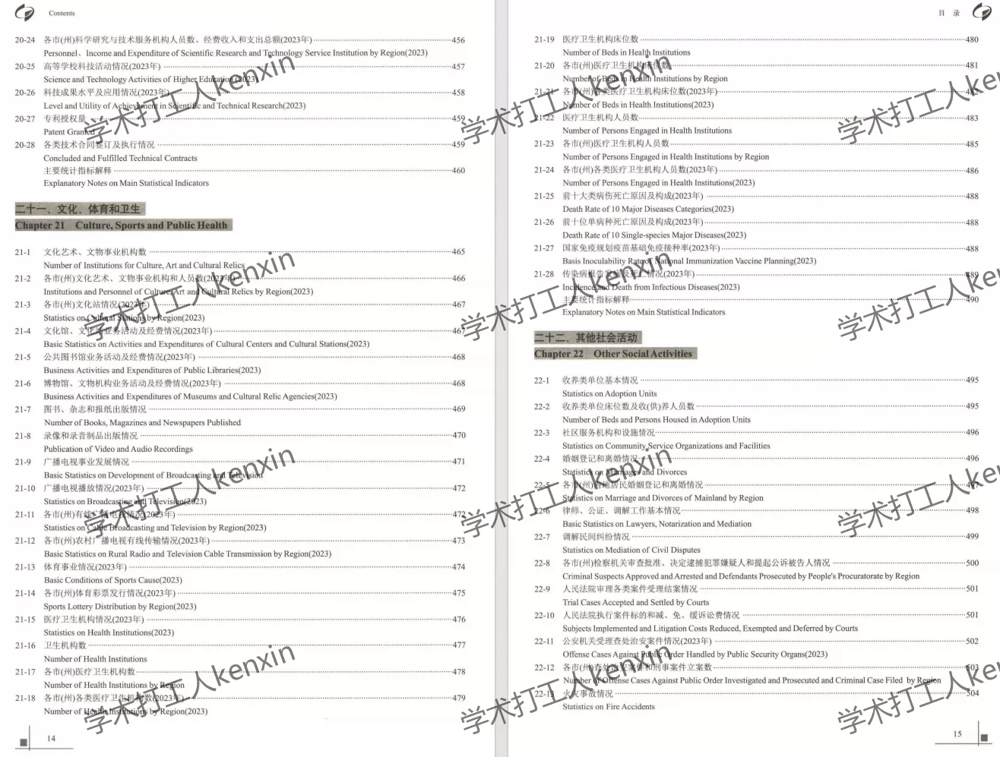

## Body

"Sichuan Statistical Yearbook" (1987-2025)

Data Year: The yearbook covers data from 1987 to 2025, with the data recorded for the previous year.
All entries are raw yearbooks, not panel data compiled neatly! Please be clear about your intentions before purchasing and understand that once purchased, there will be no returns or exchanges.

01. Data Introduction
"Sichuan Statistical Yearbook" (1987-2025)

02. Indicator Details
The directory is displayed in the image for reference. Due to the limited space of the image, it cannot display all entries. The actual content of the yearbook should be considered when viewing. Please view on your own and make a purchase accordingly. If you need help finding specific indicators, they are all here. After shipment, unreasonable returns are not supported.
The display directory is for 2024, for reference only. Different years may have varying statistical criteria. For academic purposes, please be informed.

03. Data Format
Format: EXCEL and PDF. For 2025, it is EXCEL. If you are concerned, please do not purchase. Before making a purchase, please make sure you understand the format.

## Images

item_1071470439920

Here is a pay link on Stripe ( https://buy.stripe.com/3cs8yP7sY87d0vu9AB ). Please contact me lonlonago@foxmail.com after funding $89, and I will send you a complete data files , thank you!

